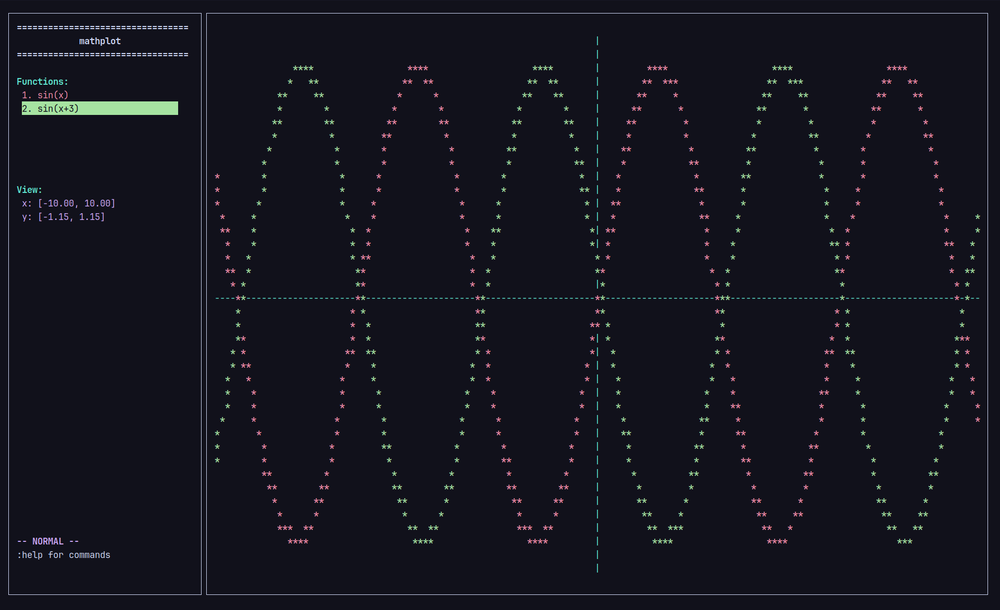

# mathplot

math plotting tui with support for multiple functions, finding derivatives and integral,
etc using `ncurses`

currently is has these features:

- this plotting tui has the insane ability to plot
- you can plot multiple functions
- you can also trace said functions to find specific coordinates
- you can also view the numerical derivatives at any given point
- you can calculate the definite integral of functions (using simpsons rule) and
find local minima and maxima
- uhhhhhh
- exporting as png and text?
- zooming and stuff
- command suggestions

## installation

### stuff you need

- gcc/clang
- cmake
- ncurses

<details>
  <summary>how to install deps</summary>

  on deb/ubuntu

  ```bash
  sudo apt-get install build-essential cmake libncurses5-dev libncursesw5-dev
  ```
  
  on fedora

  ```bash
  sudo dnf install @development-tools cmake ncurses-devel
  ```
  
  on arch

  ```bash
  sudo pacman -S base-devel cmake ncurses
  ```

</details>

### build

1) clone the repo:

   ```bash
   git clone https://github.com/TheUnium/mathplot.git
   cd mathplot
   ```

2) create the build dir:

   ```bash
   mkdir build
   cd build
   ```

3) run cmake and make

   ```bash
   cmake ..
   make
   ```

4) run

   ```bash
   ./mathplot
   
   # inside mathplot, to get a list of commands/features you can use :help
   ```

## screenshots


